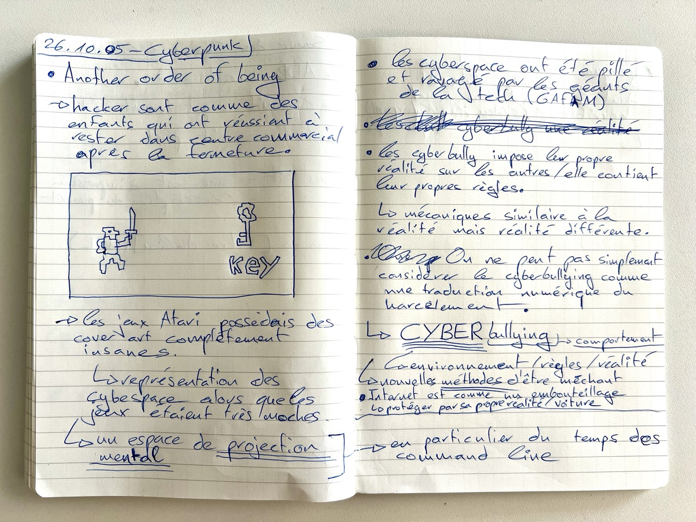

# Process
We will document our process in this folder. 
We draw inspiration from [Pippin Barr's](https://github.com/pippinbarr) creative process ([itisasifyouweredoingwork](https://github.com/pippinbarr/itisasifyouweredoingwork)).

## 26.10.05 - Cyberpunk (w/ Sabrina Calvo)

 

**Cyberpunk is not about aesthetic !**  
Documentation of the marginals of the cyber society. 

Cyber --> An absolute objective point of view 

Maya --> Illusion 

**Style is substance !** 
Cyberpunk became an aesthetic trend. The political aspect has disappeared or been recycled (again and again). 

**Post Cyberpounk:**  
What if we can make things better ? What after the shock ?  
Things **can** look better once we went trough the trauma. 

REF:

- [The Cybernetic Hypothesis](https://theanarchistlibrary.org/library/tiqqun-the-cybernetic-hypothesis)
- [Bruce Bethke / Cyberpunk](https://en.wikipedia.org/wiki/Cyberpunk_(short_story))
- [William Gibson / Neuromancien](https://fr.wikipedia.org/wiki/Neuromancien)
- [Burning Chrome](https://fr.wikipedia.org/wiki/Grav%C3%A9_sur_chrome_(nouvelle))
- [Philip K. Dick](https://fr.wikipedia.org/wiki/Philip_K._Dick)
[Naked Lunch](https://en.wikipedia.org/wiki/Naked_Lunch)
- [Do Androids Dream of Electric Sheep?)](https://fr.wikipedia.org/wiki/Les_andro%C3%AFdes_r%C3%AAvent-ils_de_moutons_%C3%A9lectriques_%3F)
